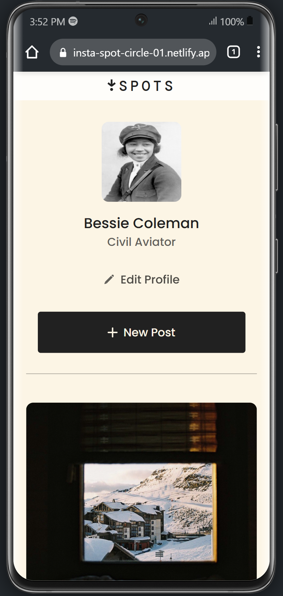

# 📸 Insta-Spot

### AltSchool Africa – Spots

A responsive **photo-sharing web page** inspired by platforms like Instagram and Pinterest.

Initially built collaboratively with **HTML**, **CSS** and **Javascript**, and converted soley to **React**.

## Screenshot


---

## 🔍 Project Overview

This project was initially assigned to Althschool Frontend Tinuyka students by [Mr. Oluwasetemi Ojo](https://github.com/Oluwasetemi) as a group project.

After building together as a group, we were asked to individually convert it to a React project.

> **First challenge**: Create a **profile page** with a photo grid, and minimal interactions like edit profile and make new post which reflects in the photo grid section, also make the images previewable in a modal and do this collaboratively as a group.

**Next Challenge**: Convert the project to a React app

---

### 🌐 Live Demo

🔗 [View Insta-Spot Live on Pipeops](https://spots.pipeops.net/)

---

## 🛠 Tech Stack

- React with Vite
- CSS3 (Flexbox + Grid)
- Javascript

---

## 📁 Features

- 👤 **User Profile**: Name, description, and avatar
- ➕ **"New Post" Button**: User can add a new post containing an image and a title.
- ✏️ **"Edit Profile" Button**: User can edit the profile name, description and image.
- 🖼 **Responsive Gallery**: CSS grid layout for dynamic resizing
- ❤️ **Like Icons**: Hover states and like functionalty
- 📱 **Mobile-Friendly**: Optimized for all screen sizes

---

## 💻 How to Run Locally

```bash
# Clone the repository
git clone https://github.com/Ejiro-Frances/spots.git

# Navigate into the project folder
cd spots

# install modules
npm install

# run in the browser
npm run dev
```

---

## 📸 Screenshots

| 🖥️ Desktop View                  | 📱 Mobile View                 |
| -------------------------------- | ------------------------------ |
|  |  |

---

## 👥 Team

A team of _10 passionate learners_ from **AltSchool Africa Tinyuka School of Enginnering**, collaborated on the first version of this project.

- Ejiro Francess Ejoh
- Reuben Agbor
- Busari Olanrewaju
- Esther Oluwatimilehin
- Elinah Mmbone
- Salaudeen Rukayat Temitope
- Doris Senyah Afriyie
- Adebomi Omodolapo Ademola
- O-Oluyomi Boluwatife
- Lateefat Bello

---

## 🙏 Acknowledgements

Special thanks to:

- **AltSchool Africa** – for providing a strong foundation in frontend development
- **[Mr. Oluwasetemi Ojo](https://github.com/Oluwasetemi)** – our supportive instructor for the Tinyuka Frontend track

---
